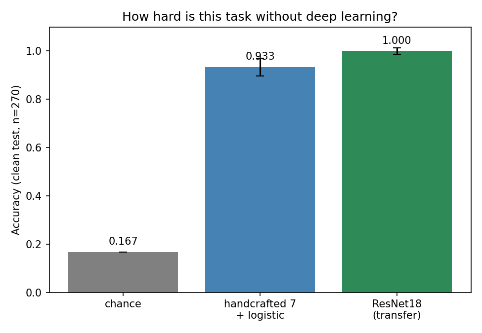
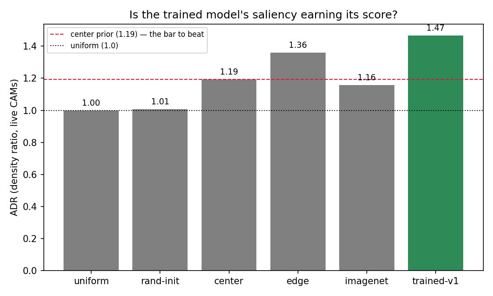
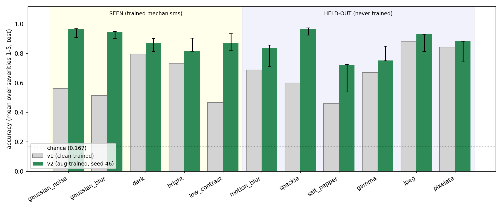
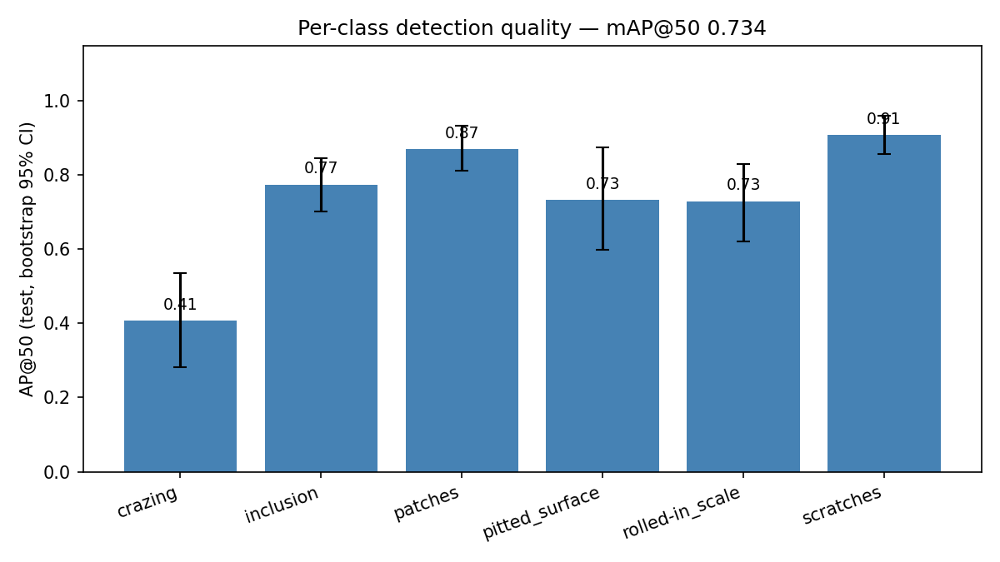

# Steel Surface Defect Inspection — interrogating a 100%, fixing it, and reposing the problem

[🇰🇷 한국어](README.md) | [🇯🇵 日本語](README.ja.md) | 🇺🇸 English

A transfer-learning classifier scored **1.000 accuracy** on a clean test set. Instead of celebrating that number, this repository **interrogates it (Act 1), explains why it collapses (Act 2), actually fixes it (Act 3), and re-poses the problem itself (Act 4).**

> **Four-line TL;DR:**
> ① All four suspects behind a 100% (leakage / easy task / small eval set / loose grading) were measured — leakage dismissed, "easy" and "loosely posed" confirmed
> ② Degradation-augmented retraining improves **all 6 held-out corruptions the model never trained on** (up to +36.5pp) — at a real cost: clean 1.000→0.967 (McNemar p=0.004)
> ③ Grad-CAM implemented from scratch and verified, turning the "edge reliance" hunch into numbers — what collapses under corruption is not saliency focus but its **existence** (dead-CAM rate 0→29%)
> ④ Multi-label and detection on the same backbone recover what single-label **could not express in principle** (multiple defects, location, count)

---

## Act 1 · Discovery — "what was the 1.000?"

A clean-test 100% has exactly four possible causes. All four were measured. (Details: [docs/01-data-audit.md](docs/01-data-audit.md))

| Suspect | Method | Verdict |
|---|---|---|
| Data leakage | md5 sweep + 32×32 cosine near-duplicate audit | **Dismissed** — zero identical files. Dropping all 54 images with r>0.90 (visually: similar-looking but *distinct* plates) still gives 1.000 [0.983, 1.000] |
| Small eval set | Wilson interval | **Conditional** — the honest reading of 1.000 is "**at least 0.986**" (n=270) |
| Easy task | **7 handcrafted texture statistics** + logistic regression | **Confirmed** — **0.933** [0.897, 0.957] with no deep learning |
| Loose grading | Cross-check against the shipped bounding boxes | **Confirmed** — below |

**The loose-grading evidence:** the archive is distributed as `NEU-CLS` but ships detection boxes for all 1,800 images (4,189 boxes — effectively **NEU-DET**). **123 images (6.8%)** carry a defect box of another class than their filename; in the test split, **23 of 270 (8.5%) have more than one right answer yet were graded against a single label.** Even "the representative defect" is criterion-dependent (filename disagrees with the count-majority on 22 images, with the area-majority on 8, intersection 1). The data was not wrong — **my flattening of a detection dataset into single-label classification was.** This finding is the reason Act 4 exists. (Fully reproducible: `audit_data.py`, `audit_neardup.py`, `baseline_handcrafted.py`)



## Act 2 · Explanation — "why and how does it collapse?"

The v1 five-bar robustness test was rebuilt into an **11-corruption × 5-severity ladder** (`corruptions.py`). Families usable for training and the 6 held-out corruptions (near/mid/far) are **physically separated by an import-time assert**; ladder intensities were calibrated on val and frozen — test is seen once per model. (Details: [docs/02-robustness.md](docs/02-robustness.md))

v1 baseline (test, mean over severities): **clean 1.000 / seen 0.614 / near 0.643 / mid 0.565 / far 0.863**

The v1 hunch "it relies on sharp texture" was tested with a **from-scratch Grad-CAM** (`gradcam.py`, self-verified via the GAP∘fc identity, max diff 1.2e-07). Because boxes exist, saliency is *scored*, not eyeballed: (Details: [docs/03-explainability.md](docs/03-explainability.md))

- 6-rung baseline battery: uniform 1.00 → center prior 1.19 → **pure edge energy 1.36** → trained model **1.47** (ADR). It beats everything — but **the thin margin over edges is itself quantitative evidence of edge reliance**. The pointing game margin is wide (0.52→**0.81**)
- Deletion test passed — deleting top-CAM cells collapses accuracy faster than random deletion everywhere (faithfulness)
- Under corruption, surviving heatmaps stay focused (ADR ≈ 1.5); what collapses is heatmap **existence** — dead rate 0% → 20–29%



## Act 3 · Fix — "fixed it, and verified the claim of fixing"

Retraining adds 4 corruption families (noise, blur, brightness, contrast) drawn from **continuous ranges** (`train_robust.py`, 5 seeds). Evaluation presets are never reused; held-out families are blocked in code. The primary seed is chosen **by val score only** — the seed with the best clean test accuracy was *not* selected.

| Zone (test, severity mean) | v1 | v2 | seed range |
|---|---|---|---|
| clean | 1.000 | 0.967 | 0.967–0.993 |
| seen — trained mechanisms, expected to rise | 0.614 | **0.894** | 0.886–0.895 |
| **held-out near** | 0.643 | **0.899** | 0.835–0.905 |
| **held-out mid** | 0.565 | **0.738** | 0.653–0.741 |
| **held-out far** — jpeg/pixelate, no cousin trained | 0.863 | **0.906** | 0.778–0.906 |

**All 6 held-out corruptions improved**: speckle +0.365 · salt_pepper +0.264 · motion_blur +0.147 · gamma +0.081 · jpeg +0.047 · pixelate +0.040

**The honest cost:** clean 1.000 → 0.967. Same 270 images, paired comparison → **McNemar's exact test**: 9 images only v1 got right, 0 only v2, **p = 0.004**. The drop is a real price of robustness, not noise.



## Act 4 · Reposing — "what single-label could never do"

Act 1's finding (23 multi-defect test images) is resolved at the problem-definition level. All three models share **the same ResNet18 backbone and the same 270 test images**.

| Model | Grading (box multi-hot) | Result |
|---|---|---|
| Single-label v1 (argmax) | subset accuracy | 0.915 — **exactly at its structural ceiling** (23 multi-defect images are unwinnable in principle) |
| Multi-label (BCE, a 20-line change) | subset accuracy | **0.926** — ceiling broken; missed defect pairs 23→18 |
| Detection (Faster R-CNN) | mAP@50 / operating point | **0.734** (mAP@50-95 0.350, per-class 0.41–0.91) / miss 19.4% · 1.87 false alarms/image (threshold 0.45, **chosen on val**) |

The detection design was justified without training (`anchor_recall.py`): default anchor ratios catch only **16.3%** of the thin, elongated scratches boxes → adding ratios 0.1/10 raises it to **92.8%** (overall 84.6→97.4). Device is CPU — MPS detection, measured *after* `synchronize()`, was hundreds of times slower (without sync you only time kernel queueing). The 50-image memorization gate (mAP@50 ≥ 0.9) came in at 0.667 — below the bar; the trajectory (0.04→0.67) confirmed the pipeline works and we proceeded, recording the miss. (Details: [docs/04-detection.md](docs/04-detection.md))



## What I learned (v1 + v2)

- **A 100% is not a conclusion but the start of an interrogation.** Verification means measuring each of the four candidate causes.
- **Two silent bugs caught and pinned by regression tests.** ① a condition-key mismatch evaluated untransformed originals ② re-splitting stacked new splits on old ones, leaking train/test — both "look fine on the first run". Four pytest cases keep them out.
- **Boundaries are enforced by code, not prose.** Held-out violations die on an assert; the split's evidence lives in manifests; every reported number lives in `results/*.json`.
- **Reproducibility traps:** Python's `hash()` differs per process (replaced with crc32), unsorted shuffles depend on the OS, and GPU training does not reproduce exactly even when seeded (a frozen weight backup is the answer key).
- **Statistics must match the design:** McNemar for paired comparisons, Wilson for proportions. No accuracy without an n.
- **Metrics need their own baselines:** ADR's random line is not 1.0 but the center prior's 1.19. A number without a baseline is not a claim.
- **Negative results are results:** TTA hurt in measurement (clean 1.000→0.830), and far-zone gains are small (+0.04) — reported as-is, not inflated.

## How to run

```bash
# 0) data (~26MB) and environment
curl -sL -o NEU-CLS.zip "https://ndownloader.figshare.com/files/54094775"
unzip -q NEU-CLS.zip -d data
python3 -m venv venv && source venv/bin/activate && pip install -r requirements.txt

# Act 1 — foundation and audits
python prepare_data.py            # re-split + splits/ manifests
python train.py                   # v1 training → best_model.pth (backup: best_model_v1.pth)
python analyze.py
python audit_data.py
python audit_neardup.py
python baseline_handcrafted.py
python -m pytest tests/ -q

# Act 2 — bench and explanation
python bench_robust.py --model best_model_v1.pth --split test --name v1
python gradcam.py && python cam_metrics.py && python cam_baselines.py

# Act 3 — retraining and verdict
for s in 42 43 44 45 46; do python train_robust.py --seed $s; done
python compare_robust.py

# Act 4 — multi-label and detection
python train_multilabel.py && python eval_multilabel.py
python anchor_recall.py
python detect_train.py --sanity
python detect_train.py --epochs 10          # CPU, tens of minutes
python detect_eval.py --split val           # choose the operating point
python detect_eval.py --split test --threshold 0.45
python detect_visualize.py --threshold 0.45
```

> Data: NEU surface defect database (Northeastern University, Song & Yan). Distributed on Figshare as `NEU-CLS` but ships detection annotations (NEU-DET-style). CC BY 4.0 as declared by the redistributor.
> GPU arithmetic is non-deterministic even when seeded; retrained numbers may differ slightly. The answer key for v1 numbers is the local `best_model_v1.pth`.

## Project structure

```
common.py / labels.py        # shared parts (constants·model·results·stats / box labels)
prepare_data.py              # re-split + splits/ manifests
train.py → analyze.py        # v1 train/score (the v1 answer key — do not modify)
robustness.py                # v1's five degradations (preserved)
audit_data.py / audit_neardup.py / baseline_handcrafted.py     # Act 1
corruptions.py / bench_robust.py                                # Act 2 bench
gradcam.py / cam_metrics.py / cam_baselines.py                  # Act 2 explanation
train_robust.py / compare_robust.py                             # Act 3
train_multilabel.py / eval_multilabel.py                        # Act 4 multi-label
detect_dataset.py / detect_train.py / detect_eval.py
detect_visualize.py / anchor_recall.py                          # Act 4 detection
tests/                       # regression tests (leakage · no-op · parsing)
splits/  results/  figures/  runs/  docs/                       # the evidence
best_model_v1.pth            # (local only) v1 baseline — never overwrite
```

## Limitations

- Single-source lab captures — the real field distribution is unknown; degradations are simulated and applied one at a time (no compound conditions)
- No "normal / defect-free" class, so every image is forced into one of 6 defect types
- The similar-frame concern is mitigated by measurement, not eliminated — a similarity-graph group split is a v3 candidate
- Detection is a minimal CPU-budget configuration (10 epochs); read its numbers as results of that budget

What was deliberately not done and why (YOLO licensing, serving, MLOps tooling, TTA): [docs/05-decisions.md](docs/05-decisions.md)
