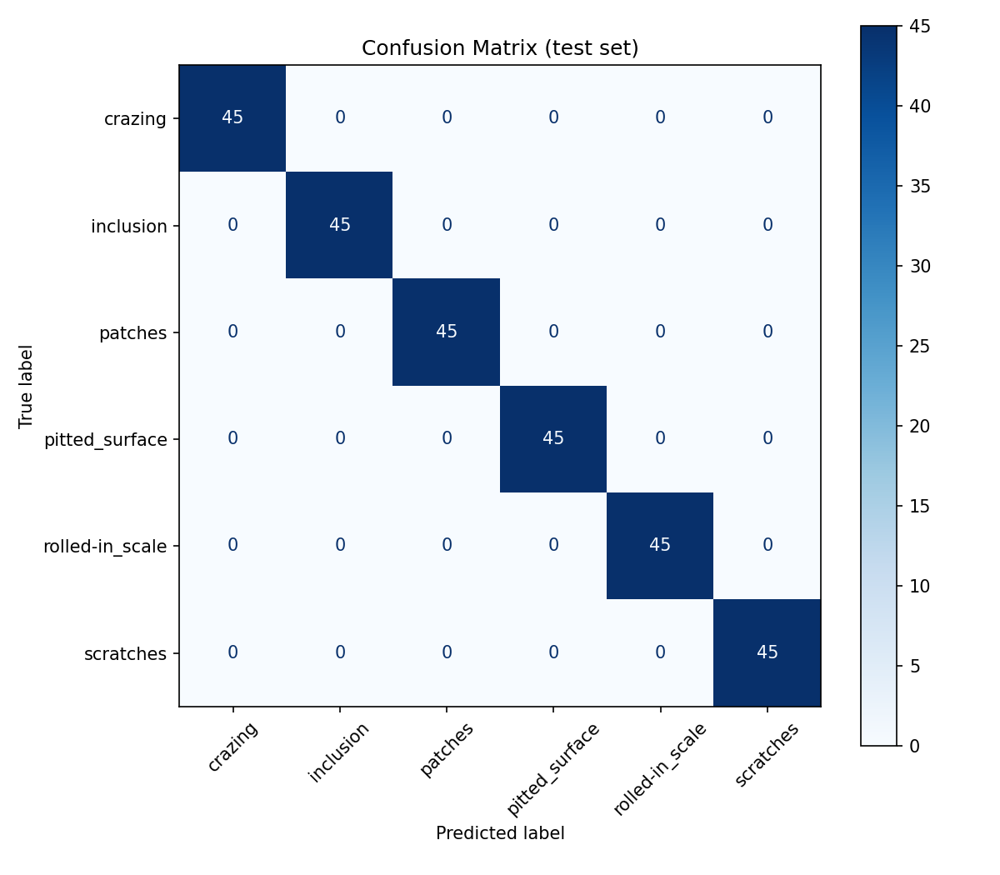
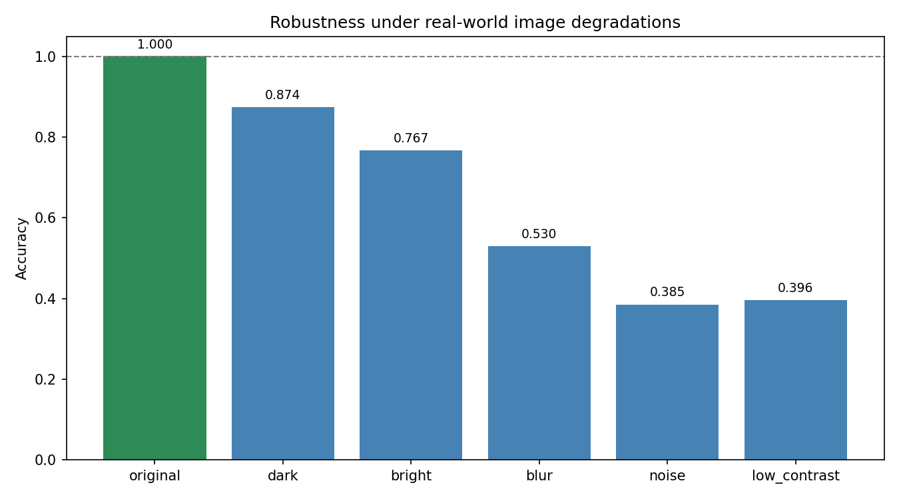

# 강철 표면 결함 분류 (NEU-CLS) + 강건성 분석

🇰🇷 한국어 | [🇯🇵 日本語](README.ja.md) | [🇺🇸 English](README.en.md)

제조 공정에서 나오는 **강철 표면 결함 6종**을 전이학습(ResNet18)으로 분류하고,
**"실험실 정확도가 현장에서도 유지되는가"**를 강건성(robustness) 테스트로 검증한 프로젝트임.

> **요약:** 깨끗한 데이터에선 정확도 100%였지만, 현장 악조건(흐림·노이즈·저대비)을 주입하자
> 38~53%까지 떨어졌음. 즉 이 모델은 실험실 조건에 과의존적이며, 현장 투입 전 열화 증강이 필요함을 정량적으로 확인했음.

---

## 1. 문제 정의

- **목표:** 육안 검사를 대체할 표면 결함 자동 분류기
- **분류 대상 6종:** crazing(잔균열), inclusion(개재물), patches(반점), pitted_surface(점부식), rolled-in_scale(압연 스케일), scratches(긁힘)
- **접근:** 사전학습 ResNet18을 전이학습으로 미세조정

## 2. 데이터

- **출처:** NEU 표면결함 데이터베이스 (Northeastern University, Song & Yan · CC BY 4.0, 재배포본 표기 기준)
  - ⚠️ 받는 곳은 `NEU-CLS`로 표기돼 있지만 **내용물은 1,800장 전부에 바운딩박스가 딸린 탐지용 주석**임. 분류 전용 NEU-CLS에는 박스가 없으므로 실질적으로 NEU-DET 계열 배포본임. 이 프로젝트는 그 박스를 접어 분류 문제로 푼 것이고, 그 사실이 아래 '한계'의 근거가 됨
- **구성:** 1,800장, 6클래스 균형(클래스당 300장), 200×200
- **분할:** train **1,260**(70%) / val **270**(15%) / test **270**(15%) — 클래스 비율 유지 stratified, `seed 42` 고정
  - ⚠️ 원본은 train 1,770 / valid 30으로 나뉘어 있어, 검증셋에서 **한 장 틀릴 때마다 정확도가 3.3%p씩** 튀었음. 이런 검증셋으로 best 모델을 고를 수는 없어 **직접 재분할**해 검증셋을 **9배(270장)**로 확보함 (`prepare_data.py`)
  - 셔플 전 `sorted()`를 한 번 넣어 파일시스템 순서에 의존하지 않게 함 — 정렬 없이 시드만 고정하면 다른 환경에서 재현이 깨짐
  - 클래스 **안에서** 셔플하는 층화 분할임. 전체를 한 번에 섞으면 특정 클래스가 test에 몰려 클래스별 성적표를 믿을 수 없게 됨

## 3. 방법

| 항목 | 내용 |
|---|---|
| 모델 | ResNet18 (ImageNet 사전학습) + 마지막 fc층을 6종용으로 교체 |
| 증강 | RandomHorizontalFlip, RandomRotation(±15°) |
| 손실/최적화 | CrossEntropyLoss / Adam (lr=1e-3) |
| 학습 | 12 epochs, **val 정확도 최고 시점 모델 저장**(과적합 방지) |
| 장치 | CUDA·MPS(Apple GPU)·CPU 자동 선택 — 본 실험은 Apple Silicon MPS |

## 4. 결과 — 깨끗한 test 데이터

**test 정확도 100%** (270장, 클래스별 precision/recall 모두 1.000)



혼동행렬이 완벽한 대각선 → 클래스 간 혼동 없음.
**다만 이 "너무 완벽한" 결과를 신뢰하지 않고**, 아래 강건성 테스트로 실제 실력을 검증했음.

## 5. 강건성 분석 (핵심)

현장에서 실제로 발생하는 이미지 열화 5종을 test 데이터에 주입하고 정확도 변화를 측정했음. (`robustness.py`)
열화 강도는 **"사람은 아직 결함을 알아볼 수 있는"** 선에 맞췄음. 사람이 구분 가능한데 모델이 못 하면, 그것이 모델의 의존 단서를 드러내는 증거가 되기 때문임.

| 조건 | 주입 방식 | 정확도 | 원본 대비 |
|---|---|---|---|
| 원본 (기준) | — | **1.000** | — |
| 어두움 | 밝기 **0.4배** — 조명이 약한 현장 | 0.874 | −12.6%p |
| 밝음 | 밝기 **1.7배** — 조명 과다·금속 반사 | 0.767 | −23.3%p |
| 흐림 | 가우시안 블러 **k=9, σ=3.0** — 초점 불량·먼지 | 0.530 | −47.0%p |
| **노이즈** | 가우시안 노이즈 **σ=0.12** — 저가 센서 | **0.385** | **−61.5%p** |
| 대비 낮음 | 대비 **0.3배** — 뿌옇게 찍힌 화면 | 0.396 | −60.4%p |



**해석:**
- 조명 변화엔 비교적 버티지만, **노이즈·저대비·흐림엔 취약함** (최대 −61%p)
- 원인: 학습 데이터가 깨끗한 실험실 촬영본이라, 모델이 **선명한 텍스처에 의존**하도록 학습된 것으로 보임
- 결론: 현장 투입 전 **노이즈·블러·대비 증강을 추가한 재학습**이 필수임

## 6. 배운 점 / 회고

- **높은 정확도 ≠ 좋은 모델.** 100%는 데이터가 쉬웠던 결과였고, 강건성 테스트로 실제 약점을 드러냈음.
- **"조용한 버그"를 직접 겪음.** `CONDITIONS` 키와 `make_transform()` 분기 이름이 어긋나 **아무 변형도 적용되지 않은 원본이 그대로 평가**되고 있었음. 파이썬은 여기서 에러를 내지 않아 결과가 틀린 게 아니라 *좋아 보였음* — 에러 없이 결과만 틀리는 버그가 가장 위험하고, 그걸 잡아준 건 디버거가 아니라 "이 숫자가 왜 이렇지"라는 의심이었음.
- **눈에 띄게 만들어야 잡힘.** 이후 조건별 결과와 원본 대비 하락폭을 한 줄씩 출력하게 바꿔, 무변형으로 통과한 조건이 바로 드러나도록 만들었음.
- **두 번째 "조용한 버그" — 이번엔 재현 스크립트.** `prepare_data.py`가 출력 폴더를 지우지 않고 덮어쓰기만 해서, 시드나 분할 비율을 바꿔 다시 돌리면 **이전 분할이 남은 채 새 분할이 그 위에 쌓였음.** 20장짜리 축소 데이터로 재현해보니 train과 test에 같은 이미지 6장이 동시에 들어갔음. 첫 실행만 보면 멀쩡해 보인다는 점이 앞의 버그와 똑같았음 — 재현 스크립트는 "한 번 돌면 되는 것"이 아니라 **"몇 번을 돌려도 같아야 하는 것"**임.
- **변형의 순서가 의미를 결정함.** 밝기·대비·블러는 PIL 단계에서, 노이즈는 `ToTensor()` 뒤(0~1 정규화 상태)에 더해야 σ 값의 의미가 고정됨. `clamp(0,1)`을 빼면 노이즈가 아니라 **정규화 왜곡**을 측정하게 됨. `Normalize`는 언제나 마지막임.
- **test를 학습 중에 들여다보면 안 됨.** 코드가 test로 학습하지 않아도 **내가 test 점수를 보고 하이퍼파라미터를 고르게 됨** — 그 순간 test는 더 이상 본 적 없는 데이터가 아님.
- **재현성은 시드 고정만으로 성립하지 않음.** 정렬·분할·노이즈·학습 시드를 함께 묶어야 같은 명령이 같은 결과를 냄.
- **평가 설계가 중요함.** 원본의 부실한 val 분할을 그대로 쓰지 않고 재분할한 것이 신뢰할 수 있는 결과의 전제였음.

## 7. 다음 단계

- 열화 조건을 증강에 포함한 재학습 → 강건성 회복 실험
- 결함 위치까지 찾는 **객체 탐지(YOLO)**로 확장 — 위 다중 라벨 문제를 근본에서 푸는 방향이기도 함 (라벨은 이미 갖춰져 있음)
- Streamlit/Gradio 데모 배포

---

## 실행 방법

```bash
# 1) 데이터 내려받기 — NEU-CLS (~26MB, CC BY 4.0, Figshare)
curl -sL -o NEU-CLS.zip "https://ndownloader.figshare.com/files/54094775"
unzip -q NEU-CLS.zip -d data

# 2) 환경 설정
python3 -m venv venv && source venv/bin/activate
pip install -r requirements.txt

# 3) 파이프라인 실행
python prepare_data.py    # data/ → dataset/ 로 재분할 (train/val/test)
python train.py           # 학습 → best_model.pth 생성
python analyze.py         # 혼동행렬 + 클래스별 성적표
python robustness.py      # 강건성 테스트 → robustness.png
python audit_data.py      # 데이터 감사 (분할 누수 · 문제 정의 · 다중결함 그림)
python audit_neardup.py   # 근접중복 감사 + 의심분 제외 재평가
python -m pytest tests/ -q  # 회귀 테스트 (분할 누수 · 무변형 열화)
```

> 데이터 원본: NEU 표면결함 데이터베이스 (Northeastern University). 위 curl 링크가 막히면 Figshare에서 "NEU-CLS"로 검색해 받을 수 있음 — 앞서 적었듯 그 이름으로 배포되지만 내용물엔 탐지 주석이 들어 있음.
> 학습에는 무작위성이 있어(시드를 고정해도 GPU 연산 특성상) 재학습 시 수치가 본문과 조금 다를 수 있음.

## 파일 구조

```
common.py         # 공용 부품 — 클래스 목록 · 모델 뼈대 · 결과 저장 · 윌슨 신뢰구간
prepare_data.py   # NEU 원본을 분류용 폴더 구조 + stratified 3분할 (+ splits/ 매니페스트)
train.py          # ResNet18 전이학습 (MPS)
analyze.py        # 혼동행렬 · 클래스별 precision/recall
robustness.py     # 이미지 열화 5종 하에서의 강건성 측정
audit_data.py     # 분할 누수 · 문제 정의 감사 (한계 항목 수치 재현)
audit_neardup.py  # 근접중복 감사 — md5가 못 잡는 '거의 같은' 이미지 + 부분집합 재평가
tests/            # 회귀 테스트 — 잡았던 버그(분할 누수 · 무변형 열화)의 재발 방지
splits/           # 분할 매니페스트(경로+md5) — 어떤 파일이 어느 분할인지의 증거
results/          # 실험 수치의 JSON 단일 출처 — 문서의 숫자는 전부 여기서 나옴
figures/          # 결과 이미지 (근접중복 갤러리 · 다중결함 실례)
confusion_matrix.png / robustness.png   # v1 결과 이미지
best_model_v1.pth # (로컬 전용, git 미추적) v1 가중치 백업 — v1 수치 재현의 유일한 기준선
```

## 한계

- 데이터가 단일 출처(NEU)의 깨끗한 촬영본이라 실제 산업 현장 분포와 차이가 있음
- 강건성 테스트는 **인위적 열화 시뮬레이션**이며 **조건을 하나씩만** 걸었음. 현장은 어두우면서 동시에 흐린 **복합 조건**이므로, 실제 현장 데이터 검증은 별도로 필요함
- **파일 단위 누수는 md5 전수 검사로 배제했음** — train↔test 동일 파일 **0건** (train↔val 1쌍은 원본 데이터셋 자체의 중복). 유사 이미지 누수 가능성도 측정했음(`audit_neardup.py`): 32×32 흑백 코사인 유사도로 test 각 장의 최근접 train을 찾으면 r>0.90이 54장 나오지만, 갤러리를 눈으로 확인한 결과 동일 강판의 재촬영이 아니라 **질감·조명이 닮은 서로 다른 판**이었음. 그 54장을 가장 보수적으로 전부 제외해도 나머지 216장 정확도 1.000 (윌슨 95% [0.983, 1.000]) — 이 요인으로 점수가 부풀지 않았음
- **내가 세운 문제 정의가 데이터 구조와 맞지 않았음.** 1,800장 전부에 바운딩박스(4,189개)가 딸려 있다는 건 원저자가 "한 장에 결함이 여러 개·여러 종류 있을 수 있다"고 전제했다는 뜻임. 실제로 **123장(6.8%)이 파일명 클래스와 다른 종류의 결함 박스를 함께 가지고 있음** — 남의 클래스 박스 188개, 전체 박스의 4.5%. 클래스별 편차도 큼: `scratches` **16.7%**, `pitted_surface` 13.0%, `patches` 9.7%인 반면 `inclusion`·`rolled-in_scale`은 **0%**. test 기준으로는 **270장 중 23장(8.5%)이 결함을 2종 이상 품은 채 단일 라벨로 채점됐음.** 데이터가 틀린 게 아니라 **탐지용 데이터를 단일 라벨 분류로 눌러 담은 쪽이 나였음** — test 100%에는 "데이터가 쉬웠다" 외에 이 문제 설정의 헐거움도 섞여 있음. 다중 라벨 분류나 탐지로 다시 세워야 함 (위 수치는 `audit_data.py`로 재현 가능)
- '정상(무결함)' 클래스가 없어 어떤 이미지든 결함 6종 중 하나로 분류함. 실제 검사 라인 투입에는 정상 클래스 추가 또는 이상 탐지 단계가 선행되어야 함
